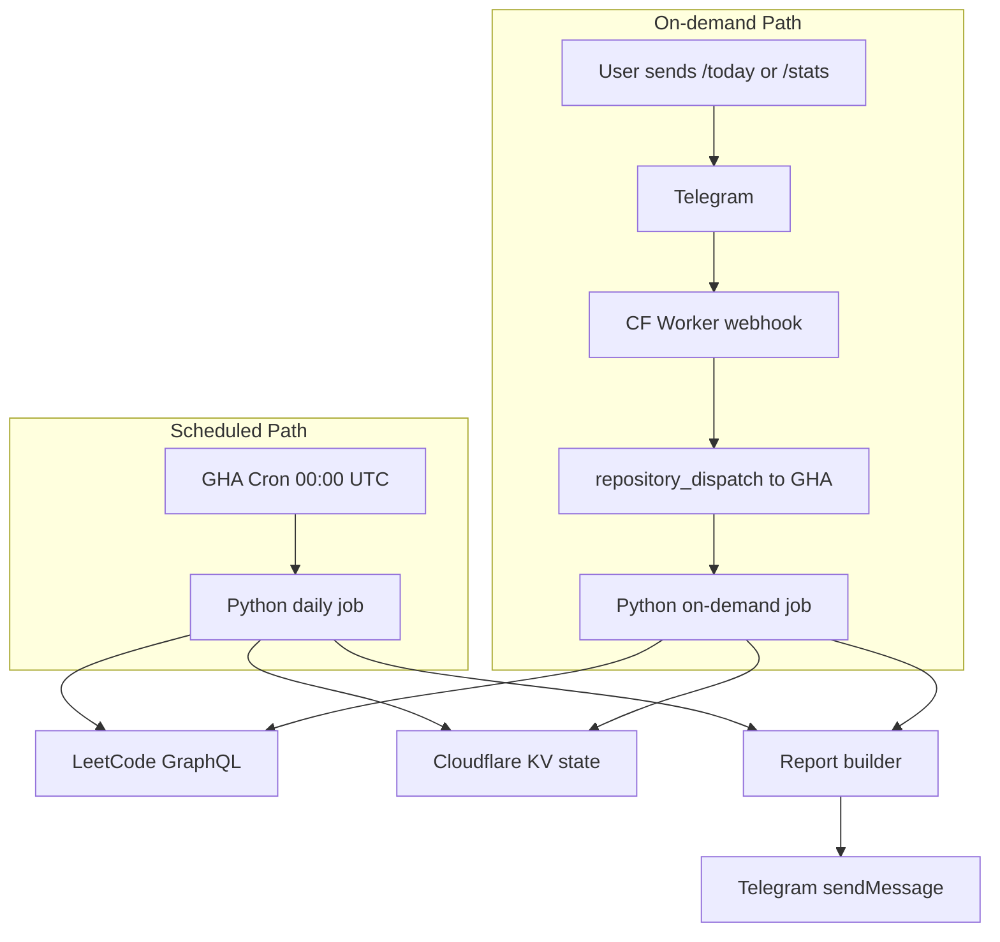

# LeetCoders 101 Bot

Automated Telegram bot that tracks daily LeetCode progress for a group of friends. Posts a scheduled report at **3:00 AM East Africa Time** and supports on-demand commands via Telegram.

**Team:** Ephrem, Henok, Gelila, Bisrat  
**Repo:** [github.com/ephrem-ketachew/leetcoders-101-bot](https://github.com/ephrem-ketachew/leetcoders-101-bot)

---

## What it does

Every day the bot fetches recent accepted submissions from LeetCode for each tracked user, counts new solves since the last run, breaks them down by difficulty, updates streaks, and posts a formatted report to your Telegram group. On-demand commands (`/today`, `/stats`) trigger the same pipeline via a Cloudflare Worker webhook.

---

## Architecture


---

## Local setup

```bash
python -m venv .venv

# Windows
.venv\Scripts\activate

pip install -r requirements.txt
cp .env.example .env   # fill in as you reach each phase
```

Verify configuration:

```bash
python -m src.main config
python -m src.main --help
```

---

## CLI commands

| Command | Phase | Description |
|---------|-------|-------------|
| `python -m src.main config` | 0 | Show loaded users and schedule |
| `python -m src.main fetch --user USERNAME` | 1 | Fetch recent LeetCode submissions |
| `python -m src.main sync [--dry-run]` | 2 | Sync state from LeetCode |
| `python -m src.main report [--send]` | 3 | Generate and optionally send report |
| `python -m src.main daily [--send]` | 4 | Full daily pipeline |

---
