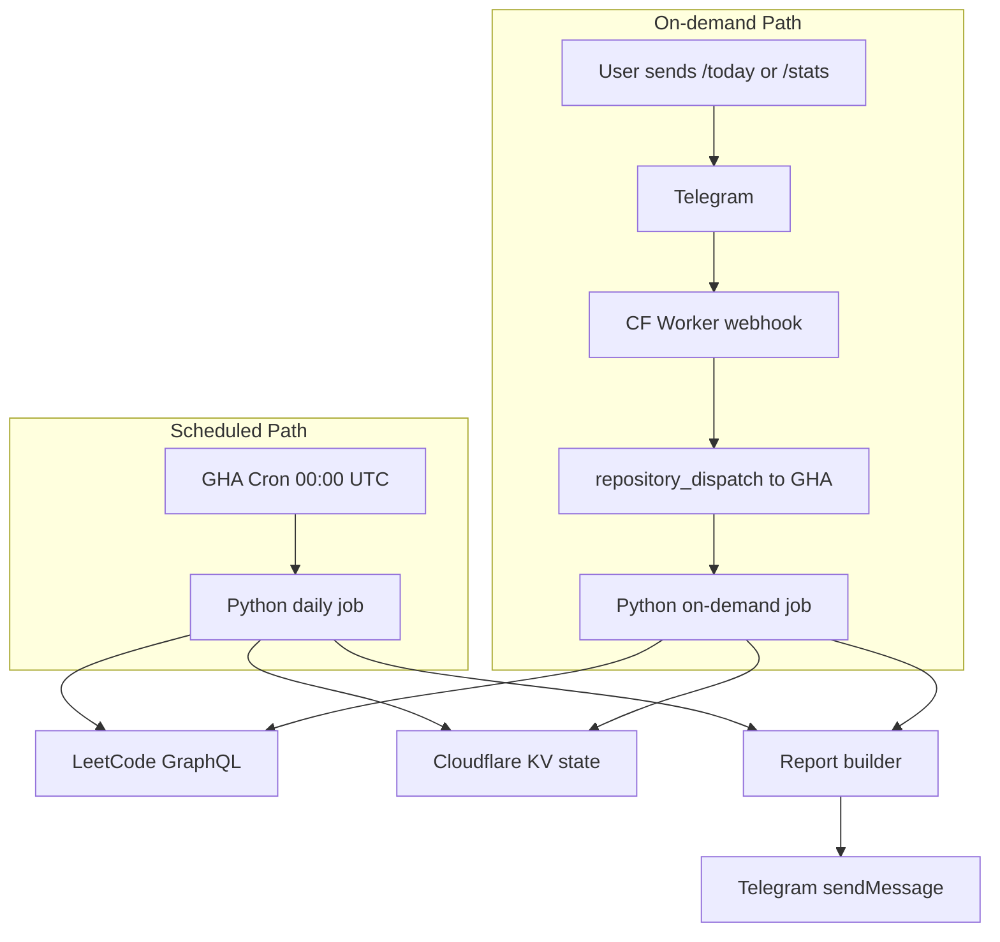

# LeetCoders 101 Bot

Automated Telegram bot that tracks daily LeetCode progress for a group of friends. Posts a scheduled report at **3:00 AM East Africa Time** and supports on-demand commands via Telegram.

**Team:** Ephrem, Henok, Gelila, Bisrat  
**Repo:** [github.com/ephrem-ketachew/leetcoders-101-bot](https://github.com/ephrem-ketachew/leetcoders-101-bot)

---

## What it does

Every day the bot fetches recent accepted submissions from LeetCode for each tracked user, counts new solves since the last run, breaks them down by difficulty, updates streaks, and posts a formatted report to your Telegram group. On-demand commands (`/today`, `/stats`) trigger the same pipeline via a Cloudflare Worker webhook.

---

## Architecture



---

## Phase status

| Phase | Description | Status |
|-------|-------------|--------|
| 0 | Project scaffold, config, docs | Done |
| 1 | LeetCode GraphQL client + problem cache | Done |
| 2 | Cloudflare KV state + incremental sync | Done |
| 3 | Report builder + Telegram sender | Done |
| 4 | GitHub Actions daily cron | Done |
| 5 | Cloudflare Worker on-demand commands | Pending |
| 6 | Retries, error handling, polish | Pending |

---

## Local setup

```bash
python -m venv .venv

# Windows
.venv\Scripts\activate

pip install -r requirements.txt
copy .env.example .env   # fill in as you reach each phase
```

Verify configuration:

```bash
python -m src.main config
python -m src.main --help
```

---

## Phase 1 usage (LeetCode fetch)

Build the local problem difficulty cache (first run, ~10-15 seconds):

```bash
python -m src.main cache-problems
```

Fetch recent submissions for one user:

```bash
python -m src.main fetch --user ephrem-ketachew
```

Fetch all teammates from `config/users.yaml`:

```bash
python -m src.main fetch --all
```

Refresh the cache manually:

```bash
python -m src.main cache-problems --force
```

---

## Phase 2 usage (state sync)

Preview sync without writing state (first run bootstraps in memory only):

```bash
python -m src.main sync --dry-run
```

Run sync and persist state (uses local `data/state/` when Cloudflare creds are absent):

```bash
python -m src.main sync
```

Confirm no new submissions after bootstrap:

```bash
python -m src.main sync --dry-run
```

Optional: only show submissions since the last daily report (once Phase 4 sets `last_report_at`):

```bash
python -m src.main sync --since-report
```

**Note:** Without `CF_ACCOUNT_ID`, `CF_KV_NAMESPACE_ID`, and `CF_API_TOKEN` in `.env`, state is stored locally under `data/state/`. Add those variables to use Cloudflare KV instead.

---

## Phase 3 usage (report + Telegram)

Preview the daily report in your terminal (runs sync first):

```bash
python -m src.main report
```

Send the report to your Telegram group (requires `TELEGRAM_BOT_TOKEN` and `TELEGRAM_CHAT_ID` in `.env`):

```bash
python -m src.main report --send
```

The report includes per-user solve counts, difficulty breakdown, streaks, and a Highlights section. After a successful `--send`, `last_report_at` is saved so the next report only covers new activity since the last send.

---

## Phase 4 usage (GitHub Actions)

The bot posts automatically every day at **3:00 AM East Africa Time** (GitHub cron: `0 0 * * *` UTC).

### One-time: add GitHub secrets

In your repo go to **Settings → Secrets and variables → Actions** and add:

| Secret | Description |
|--------|-------------|
| `TELEGRAM_BOT_TOKEN` | From BotFather |
| `TELEGRAM_CHAT_ID` | Group chat ID |
| `CF_ACCOUNT_ID` | Cloudflare account ID |
| `CF_KV_NAMESPACE_ID` | KV namespace for bot state |
| `CF_API_TOKEN` | Token with Workers KV Storage Edit |

### Manual test (before waiting for cron)

1. Push this repo to `main`
2. Open **Actions → Daily LeetCode Report → Run workflow**

### Local equivalent

```bash
python -m src.main daily --send
```

Same pipeline as the GitHub Action: sync, build report, send to Telegram.

### Workflows

| Workflow | Schedule | Purpose |
|----------|----------|---------|
| `daily-report.yml` | Daily 00:00 UTC | Sync + report + Telegram |
| `refresh-problem-cache.yml` | Sunday 02:00 UTC | Refresh LeetCode problem cache in KV |

If the daily workflow fails, a short alert is sent to your Telegram group.

**Note:** Ensure KV has a problem cache before the first GHA run (`python -m src.main cache-problems --force` locally, which uploads to KV).

---

## CLI commands

| Command | Phase | Description |
|---------|-------|-------------|
| `python -m src.main config` | 0 | Show loaded users and schedule |
| `python -m src.main cache-problems [--force]` | 1 | Download/refresh problem difficulty cache |
| `python -m src.main fetch --user USERNAME` | 1 | Fetch recent LeetCode submissions |
| `python -m src.main fetch --all` | 1 | Fetch submissions for all configured users |
| `python -m src.main sync [--dry-run]` | 2 | Sync state from LeetCode |
| `python -m src.main report [--send]` | 3 | Generate and optionally send report |
| `python -m src.main daily [--send]` | 4 | Full daily pipeline |

---
